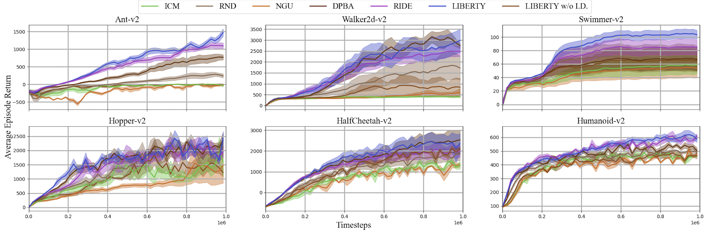

# LIBERTY:Efficient Potential-Based Exploration in Reinforcement Learning Using the Inverse Dynamic Bisimulation Metric
Here is the official code for our paper - ["LIBERTY:Efficient Potential-Based Exploration in Reinforcement Learning Using the Inverse Dynamic Bisimulation Metric"](NIPS 2023 SUBMISSION)
## 

## Requirements
- cuda-10.0
- pytorch==1.2.0
- gym==0.12.5
- gym[atari]
- mujoco-py==1.50.1.56
- mpi4py
- pillow
- tqdm

## Installation
1. Please install the required packages in the above list.  
2. Install `utils`:
```bash
pip install -e .
```
## Run Experiments
Please enter `ppo` folder to run `LIBERTY`
```bash
cd ppo/
```
## Instructions
```bash
python -u train.py --env-name='HalfCheetah-v2' --cuda (if cuda is available) --reward-delay-freq=1 --log-dir='logs' --seed=123
```

